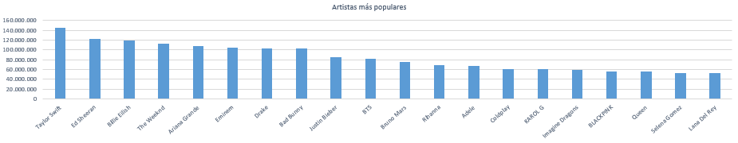
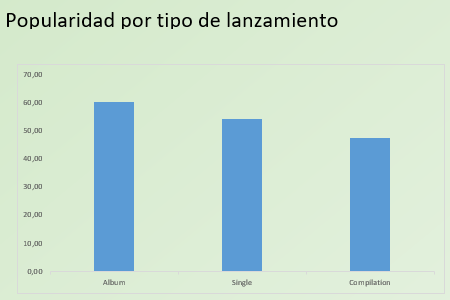

# 🎤Análisis mercado popularidad Spotify
#### ⭐Análisis de las canciones y artistas más populares de los últimos años

## 1. 📖Descripción del proyecto.

Proyecto realizado a modo de práctica para aprender a realizar un análisis EDA y un Dashboard en Excel para llevar a cabo un análisis de datos. El objetivo principal de este es ver cuales son los artistas que más pupularidad han conseguido en los últimos años.
## 2. 🗂️ Estructura del Proyecto

├── spotify_data.csv # Datos crudos

├── Analisis_Datos_Spotify.xlsx # Archivo donde se puede ver el analisis EDA y Dashboard

├── Logo/ # Carpeta con imagenes y logos utilizados en el Dashboard

├── README.md

## 3. ⚒️ Herramientas y dataset
En el proyecto se ha hecho uso principalmente de excel (Office 2024) (incluido Power Query). No ha sido necesario el uso de ningún otro programa.

La descarga de la BBDD se ha hecho desde el sitio web https://www.kaggle.com/ y el link del dataset es el siguiente (https://www.kaggle.com/datasets/wardabilal/spotify-global-music-dataset-20092025)

## 4. 📊Resultados y Conclusiones

- La artista con más número de seguidores, y por lo tanto la que consideramos mas popular es Taylor Swift, seguida de Ed Sheeran  y de Billie Ellish en segundo y tercer lugar respectivamentes

- El promedio de popularidad es algo mayor si se la canción se estrena dentro de un album que si es un Single, sin embargo como vemos la diferencia no es muy amplia

- A partir del año 2010 podemos ver un eumento de nuevas canciones, lo que indica que el mercado cada vez se está ampliando más, apareciendo más nuevas canciones y artistas

## 5. 🏃‍♂️Próximos pasos

- Sería necesario una amplizacion de canciones a lo largo de los último años para determinar un análisis mucho más exhaustivo.

- Implementar información sobre los seguidores, para conocer su edad, origen etc... 